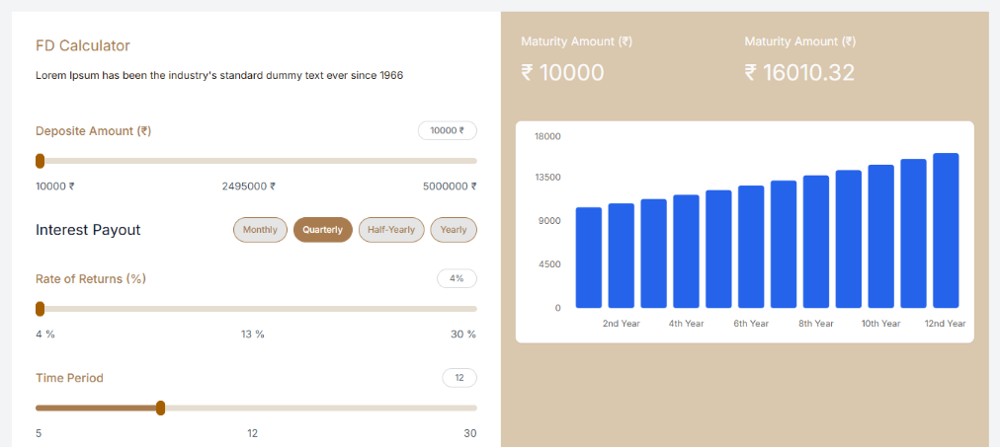

# Fixed Deposit (FD) Calculator

A modern, interactive Fixed Deposit (FD) Calculator built with **Next.js 16**, **React 19**, **Tailwind CSS v4**, **shadcn/ui**, and **Recharts**.



---

## 🌟 Key Features

- **Dynamic Deposit & Tenure Sliders**: Adjust deposit amount, rate of return, and investment period with smooth slider controls.
- **Flexible Interest Payout Frequencies**: Choose between Monthly, Quarterly, Half-Yearly, and Yearly compounding schedules.
- **Year-wise Interactive Bar Chart**: Visualize growth and returns year-over-year using responsive Recharts bar graphs.
- **Instant Calculation with Loading Feedback**: Optimized state calculation with animated loading spinners for responsive feedback.
- **Centralized State Management**: Powered by React Context (`FDContext`) for decoupled, scalable state access across calculator inputs and chart outputs.
- **Modern & Clean Design**: Elegant color palette, custom theme tokens, and accessible shadcn/ui components.

---

## 🛠️ Tech Stack

- **Framework**: [Next.js 16](https://nextjs.org/) (App Router)
- **UI & Components**: [React 19](https://react.dev/), [shadcn/ui](https://ui.shadcn.com/), [Base UI](https://base-ui.com/)
- **Styling**: [Tailwind CSS v4](https://tailwindcss.com/)
- **Data Visualization**: [Recharts](https://recharts.org/)
- **Icons**: [Lucide React](https://lucide.dev/)
- **Language**: TypeScript

---

## 📐 Calculation Formula

The application uses standard compound interest formulas based on the selected compounding frequency:

$$A = P \times \left(1 + \frac{r}{n}\right)^{n \times t}$$

Where:
- **$A$** = Maturity Amount
- **$P$** = Principal Deposit Amount
- **$r$** = Annual Interest Rate (decimal)
- **$n$** = Compounding frequency per year ($12$ for Monthly, $4$ for Quarterly, $2$ for Half-Yearly, $1$ for Yearly)
- **$t$** = Time period in years

$$\text{Total Interest Earned} = A - P$$

---

## 📁 Project Structure

```
├── app/
│   ├── globals.css          # Tailwind CSS v4 config & custom color tokens
│   ├── layout.tsx           # Root layout
│   └── page.tsx             # Main page layout wrapping provider & components
├── components/
│   ├── FDCalcultor.tsx      # Calculator inputs & slider controls
│   ├── FDBarGraph.tsx       # Recharts bar graph displaying year-wise returns
│   ├── SliderControl.tsx    # Reusable slider input control
│   ├── CustomSpinner.tsx    # Animated loading spinner
│   └── ui/                  # shadcn/ui components (Card, Badge, Slider, Chart)
├── context/
│   └── FDContext.tsx        # Centralized state management & FD formulas
└── public/
    └── preview.png          # UI preview screenshot
```

---

## 🚀 Getting Started

### 1. Prerequisites
- **Node.js** (v20 or higher recommended)
- **npm** or **yarn** / **pnpm** / **bun**

### 2. Installation

Clone the repository and install dependencies:

```bash
git clone git@github.com:demonize-c/next-fd-calcultor.git
cd next-fd-calcultor
npm install
```

### 3. Run Development Server

```bash
npm run dev
```

Open [http://localhost:3000](http://localhost:3000) in your browser to see the calculator in action.

### 4. Build for Production

```bash
npm run build
npm start
```

### 5. Type Checking & Linting

```bash
npm run typecheck
npm run lint
```

---

## 📄 License

This project is licensed under the MIT License.
